# bumtrips

**A field-recorded journey through literature, consciousness, and counterculture.**

[bumtrips.com](https://bumtrips.com) · [beatniks-bumtrips-bullshit](https://github.com/bumtrips/beatniks-bumtrips-bullshit) · [RSS](https://anchor.fm/s/4431c4ac/podcast/rss)

---

## What lives here

`bumtrips` is the home org for the **Beatniks, Bumtrips, Bullshit** podcast — your secret audio dose of acid. Spontaneous conversations about mysticism, poetry, art, music, total bullshit, sci-fi, paranoia, dream, utopia, and friendship. Field-recorded in Berlin and Santa Cruz.

The [marketing site](https://bumtrips.com) is a static, no-build, vanilla HTML/CSS/JS page served from GitHub Pages. It rotates through six acid-trip visual themes (cyber, zine, radio, desert, temple, brutalist) on auto-pilot and ships with full WCAG 2.1 AA accessibility.

## Listen

- [bumtrips.com](https://bumtrips.com) — the site
- [Apple Podcasts](https://podcasts.apple.com/us/podcast/beatniks-bumtrips-b-t/id1663479533)
- [Spotify](https://open.spotify.com/show/43GiaQy9E5rkp6LfzXrvAM)
- [RSS](https://anchor.fm/s/4431c4ac/podcast/rss)

## Tech (for the curious)

- Static HTML + minified CSS + inline JS — no build step, no framework
- GitHub Pages + custom domain (`bumtrips.com`)
- WebP covers with JPEG fallback, lazy-loaded per theme
- WCAG 2.1 AA: skip links, focus rings, forced-colors, prefers-contrast, safe-area insets
- Six rotating themes with `prefers-reduced-motion` respected

## How the site is built

AI agents did the cover art, the page structure, the a11y audit, the perf pass, and this README. Humans did the recording, the talking, and the editing.

## Contact

Open an issue on [beatniks-bumtrips-bullshit](https://github.com/bumtrips/beatniks-bumtrips-bullshit/issues) or reach the show through the [contact form on the site](https://bumtrips.com/#contact).

---

